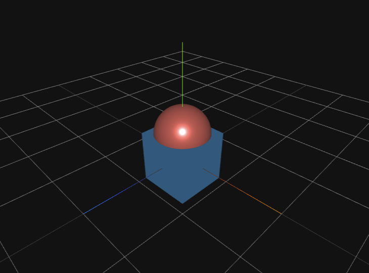
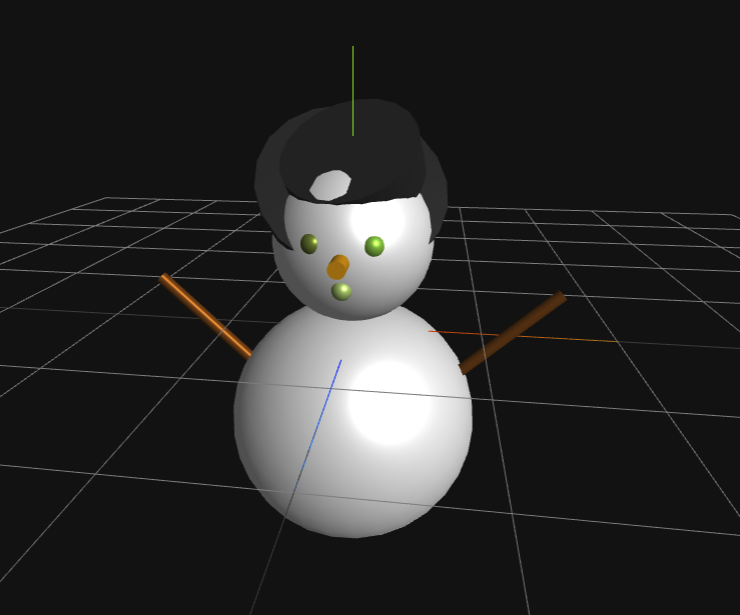

# Three.js MCP サーバー

このプロジェクトは、Three.jsを使用して、ボタンを押すと立体オブジェクトが追加されるウェブアプリケーションです。また、HTTP APIを通じて外部からも立体を追加・管理できます。追加されたオブジェクトの情報はJSONファイルに永続化されるため、サーバーを再起動しても保持されます。WebSocketを使用してリアルタイムに変更が反映されます。さらに、MCPサーバーを通じて立体の取得や追加を行うことができます。

## 機能

- ボタンをクリックすると、シーンに立体が追加されます
- マウスでカメラを操作して、3Dシーンを自由に見ることができます
- HTTP APIを使用して、外部から立体を追加・管理できます
- 追加されたオブジェクトの情報はJSONファイルに永続化されます
- WebSocketを使用してリアルタイムに変更が反映されます
- MCPサーバーを通じて立体の取得や追加を行うことができます
- シーン内のオブジェクトをSTLファイルとしてエクスポートできます

## Claude Desktopでの使用例

このMCPサーバーをClaude Desktopで使用すると、自然言語で3Dオブジェクトを作成できます。

### 例1: 直方体の上に球体の上半分が乗った立体

「直方体の上に球体の上半分が乗った立体をつくってください。」という指示で作成された立体：



### 例2: 雪だるま

「雪だるまを作ってください。」という指示で作成された立体：



## 使用技術

- Three.js - 3Dグラフィックスライブラリ
- Node.js - サーバーサイドJavaScript
- Express - Webアプリケーションフレームワーク
- WebSocket - リアルタイム通信
- HTML/CSS/JavaScript
- ファイルシステム - データの永続化
- MCP (Model Context Protocol) - AIとの連携

## セットアップ

1. 必要なパッケージをインストールします
   ```
   npm install express cors body-parser ws
   ```

2. サーバーを起動します
   ```
   node server.js
   ```

3. ブラウザで `http://localhost:3000/index.html` にアクセスします
4. APIテストページは `http://localhost:3000/test.html` でアクセス可能

## 使い方

1. 「立体を追加」ボタンをクリックして、シーンに立体を追加します
2. マウスでドラッグして視点を変更できます
3. 「STLにエクスポート」ボタンをクリックして、シーン内のオブジェクトをSTLファイルとしてエクスポートできます

## データの永続化

このアプリケーションでは、追加された立体のデータは`data.json`ファイルに保存されます。これにより、サーバーを再起動しても立体のデータが保持されます。データファイルは自動的に作成・更新されるため、特別な設定は必要ありません。

## リアルタイム更新

このアプリケーションでは、WebSocketを使用してリアルタイムに変更を反映します。立体が追加・削除されると、接続されているすべてのクライアントに通知が送信され、自動的に画面が更新されます。これにより、複数のクライアントから同時にアクセスしても、すべてのクライアントで同じ立体が表示されます。

## MCP ツール

このアプリケーションは、MCPサーバーを通じて立体の管理を行うためのツールを提供しています。

### 立体の取得

```
get-boxes
```

すべての立体の情報を取得します。

### 直方体の追加

```
add-box
```

新しい直方体をシーンに追加します。以下のパラメータを指定できます：

- `width`: 直方体の幅（デフォルト: 10）
- `height`: 直方体の高さ（デフォルト: 10）
- `depth`: 直方体の奨行き（デフォルト: 10）
- `color`: 直方体の色（デフォルト: ランダム）
  - 10進数形式: 例 `16711680`（赤色）
  - RGB形式: 例 `{ "r": 255, "g": 0, "b": 0 }`（赤色）
- `position`: 直方体の位置（デフォルト: ランダム）
  - `x`: X座標
  - `y`: Y座標
  - `z`: Z座標
- `rotation`: 直方体の回転（ラジアン単位、デフォルト: ランダム）
  - `x`: X軸周りの回転
  - `y`: Y軸周りの回転
  - `z`: Z軸周りの回転

例（個別の寸法を指定）：
```json
{
  "width": 20,
  "height": 10,
  "depth": 15,
  "color": 16711680,
  "position": { "x": 0, "y": 10, "z": 0 },
  "rotation": { "x": 0, "y": 0, "z": 0 }
}
```

例（RGB形式での色指定）：
```json
{
  "width": 10,
  "height": 20,
  "depth": 10,
  "color": { "r": 255, "g": 0, "b": 0 },
  "position": { "x": 0, "y": 10, "z": 0 },
  "rotation": { "x": 0, "y": 0, "z": 0 }
}
```

### 立体の削除

```
remove-box
```

指定したIDの立体をシーンから削除します。以下のパラメータを指定する必要があります：

- `id`: 削除する立体のID

例：
```json
{
  "id": 1618456789012
}
```

### 正n角柱の追加

```
add-prism
```

新しい正n角柱をシーンに追加します。以下のパラメータを指定できます：

- `radius`: 底面の半径（デフォルト: 5）
- `height`: 高さ（デフォルト: 10）
- `segments`: 底面の角の数（最小: 3、デフォルト: 6）
- `color`: 正n角柱の色（デフォルト: ランダム）
  - 10進数形式: 例 `16711680`（赤色）
  - RGB形式: 例 `{ "r": 255, "g": 0, "b": 0 }`（赤色）
- `position`: 正n角柱の位置（デフォルト: ランダム）
  - `x`: X座標
  - `y`: Y座標
  - `z`: Z座標
- `rotation`: 正n角柱の回転（ラジアン単位、デフォルト: ランダム）
  - `x`: X軸周りの回転
  - `y`: Y軸周りの回転
  - `z`: Z軸周りの回転

例（RGB形式での色指定）：
```json
{
  "radius": 5,
  "height": 15,
  "segments": 8,
  "color": { "r": 0, "g": 255, "b": 0 },
  "position": { "x": 10, "y": 5, "z": 10 },
  "rotation": { "x": 0, "y": 0.5, "z": 0 }
}
```

### 球体の追加

```
add-sphere
```

新しい球体をシーンに追加します。以下のパラメータを指定できます：

- `radius`: 球体の半径（デフォルト: 5）
- `widthSegments`: 横方向の分割数（デフォルト: 32）
- `heightSegments`: 縦方向の分割数（デフォルト: 16）
- `color`: 球体の色（デフォルト: ランダム）
  - 10進数形式: 例 `255`（青色）
  - RGB形式: 例 `{ "r": 0, "g": 0, "b": 255 }`（青色）
- `position`: 球体の位置（デフォルト: ランダム）
  - `x`: X座標
  - `y`: Y座標
  - `z`: Z座標
- `rotation`: 球体の回転（ラジアン単位、デフォルト: ランダム）
  - `x`: X軸周りの回転
  - `y`: Y軸周りの回転
  - `z`: Z軸周りの回転

### 正n角錐の追加

```
add-pyramid
```

新しい正n角錐をシーンに追加します。以下のパラメータを指定できます：

- `radius`: 底面の半径（デフォルト: 5）
- `height`: 高さ（デフォルト: 10）
- `segments`: 底面の角の数（最小: 3、デフォルト: 4）
- `color`: 正n角錐の色（デフォルト: ランダム）
  - 10進数形式: 例 `16711680`（赤色）
  - RGB形式: 例 `{ "r": 255, "g": 0, "b": 0 }`（赤色）
- `position`: 正n角錐の位置（デフォルト: ランダム）
  - `x`: X座標
  - `y`: Y座標
  - `z`: Z座標
- `rotation`: 正n角錐の回転（ラジアン単位、デフォルト: ランダム）
  - `x`: X軸周りの回転
  - `y`: Y軸周りの回転
  - `z`: Z軸周りの回転

例（RGB形式での色指定）：
```json
{
  "radius": 6,
  "height": 12,
  "segments": 5,
  "color": { "r": 255, "g": 128, "b": 0 },
  "position": { "x": -5, "y": 6, "z": 0 },
  "rotation": { "x": 0, "y": 0.5, "z": 0 }
}
```

### 立体の減算（くり抜き）

```
subtract-objects
```

2つの立体を減算処理（くり抜き）します。以下のパラメータを指定する必要があります：

- `targetId`: くり抜かれる立体のID
- `subtractId`: くり抜く立体のID

例：
```json
{
  "targetId": 1618456789012,
  "subtractId": 1618456789013
}
```

### すべての立体の削除

```
remove-all-boxes
```

シーン内のすべての立体を削除します。パラメータは必要ありません。

## Claude での設定方法

このMCPサーバーをClaudeで使用するには、以下の設定をClaudeの設定ファイルに追加してください。

```json
{
  "mcpServers": {
    "threejs-mcp": {
      "command": "<nodeのフルパス>",
      "args": [
        "<threejs-mcp のパス>/mcp.js"
      ]
    }
  }
}
```

- `<nodeのフルパス>`: Nodeのインストールパスを指定します（例: `/usr/local/bin/node`）
- `<threejs-mcp のパス>`: このリポジトリをクローンしたディレクトリのパスを指定します

設定後、Claudeを再起動すると、Three.js MCPサーバーを通じて3Dオブジェクトの操作が可能になります。

## HTTP API

このアプリケーションは、外部からアクセスできるHTTP APIを提供しています。すべてのAPI操作はデータファイルに永続化され、WebSocketを通じてリアルタイムに通知されます。

### 直方体の追加

```
POST /api/boxes
```

curlコマンド例:
```bash
curl -X POST http://localhost:3000/api/boxes \
  -H "Content-Type: application/json" \
  -d '{
    "width": 20,
    "height": 10,
    "depth": 15,
    "color": 16711680,
    "position": { "x": 0, "y": 10, "z": 0 },
    "rotation": { "x": 0, "y": 0, "z": 0 }
  }'
```

リクエスト例:
```json
{
  "width": 20,
  "height": 10,
  "depth": 15,
  "color": 16711680,
  "position": { "x": 0, "y": 10, "z": 0 },
  "rotation": { "x": 0, "y": 0, "z": 0 }
}
```

レスポンス例:
```json
{
  "id": 1618456789012,
  "type": "box",
  "width": 20,
  "height": 10,
  "depth": 15,
  "color": 16711680,
  "position": { "x": 0, "y": 10, "z": 0 },
  "rotation": { "x": 0, "y": 0, "z": 0 }
}
```

### すべての立体を取得

```
GET /api/boxes
```

curlコマンド例:
```bash
curl -X GET http://localhost:3000/api/boxes
```

レスポンス例:
```json
[
  {
    "id": 1618456789012,
    "type": "box",
    "width": 20,
    "height": 10,
    "depth": 15,
    "color": 16711680,
    "position": { "x": 0, "y": 10, "z": 0 },
    "rotation": { "x": 0, "y": 0, "z": 0 }
  },
  {
    "id": 1618456789013,
    "type": "sphere",
    "radius": 8,
    "color": 65280,
    "position": { "x": 10, "y": 5, "z": -5 },
    "rotation": { "x": 0.5, "y": 0.3, "z": 0.1 }
  }
]
```

### 特定の立体を取得

```
GET /api/boxes/:id
```

curlコマンド例:
```bash
curl -X GET http://localhost:3000/api/boxes/1618456789012
```

レスポンス例:
```json
{
  "id": 1618456789012,
  "type": "box",
  "width": 20,
  "height": 10,
  "depth": 15,
  "color": 16711680,
  "position": { "x": 0, "y": 10, "z": 0 },
  "rotation": { "x": 0, "y": 0, "z": 0 }
}
```

### 特定の立体を削除

```
DELETE /api/boxes/:id
```

curlコマンド例:
```bash
curl -X DELETE http://localhost:3000/api/boxes/1618456789012
```

レスポンス例:
```json
{
  "message": "立体が削除されました"
}
```

### 正n角柱の追加

```
POST /api/prisms
```

curlコマンド例:
```bash
curl -X POST http://localhost:3000/api/prisms \
  -H "Content-Type: application/json" \
  -d '{
    "radius": 5,
    "height": 15,
    "segments": 8,
    "color": 65280,
    "position": { "x": 10, "y": 5, "z": 10 },
    "rotation": { "x": 0, "y": 0.5, "z": 0 }
  }'
```

リクエスト例:
```json
{
  "radius": 5,
  "height": 15,
  "segments": 8,
  "color": 65280,
  "position": { "x": 10, "y": 5, "z": 10 },
  "rotation": { "x": 0, "y": 0.5, "z": 0 }
}
```

レスポンス例:
```json
{
  "id": 1618456789014,
  "type": "prism",
  "radius": 5,
  "height": 15,
  "segments": 8,
  "color": 65280,
  "position": { "x": 10, "y": 5, "z": 10 },
  "rotation": { "x": 0, "y": 0.5, "z": 0 }
}
```

### 球体の追加

```
POST /api/spheres
```

新しい球体をシーンに追加します。以下のパラメータを指定できます：

- `radius`: 球体の半径（デフォルト: 5）
- `widthSegments`: 横方向の分割数（デフォルト: 32）
- `heightSegments`: 縦方向の分割数（デフォルト: 16）
- `color`: 球体の色（デフォルト: ランダム）
  - 10進数形式: 例 `255`（青色）
  - RGB形式: 例 `{ "r": 0, "g": 0, "b": 255 }`（青色）
- `position`: 球体の位置（デフォルト: ランダム）
  - `x`: X座標
  - `y`: Y座標
  - `z`: Z座標
- `rotation`: 球体の回転（ラジアン単位、デフォルト: ランダム）
  - `x`: X軸周りの回転
  - `y`: Y軸周りの回転
  - `z`: Z軸周りの回転

例（RGB形式での色指定）：
```json
{
  "radius": 8,
  "widthSegments": 32,
  "heightSegments": 16,
  "color": { "r": 0, "g": 0, "b": 255 },
  "position": { "x": -10, "y": 8, "z": 5 },
  "rotation": { "x": 0, "y": 0, "z": 0 }
}
```

### 正n角錐の追加

```
POST /api/pyramids
```

curlコマンド例:
```bash
curl -X POST http://localhost:3000/api/pyramids \
  -H "Content-Type: application/json" \
  -d '{
    "radius": 6,
    "height": 12,
    "segments": 5,
    "color": 16744448,
    "position": { "x": -5, "y": 6, "z": 0 },
    "rotation": { "x": 0, "y": 0.5, "z": 0 }
  }'
```

リクエスト例:
```json
{
  "radius": 6,
  "height": 12,
  "segments": 5,
  "color": 16744448,
  "position": { "x": -5, "y": 6, "z": 0 },
  "rotation": { "x": 0, "y": 0.5, "z": 0 }
}
```

レスポンス例:
```json
{
  "id": 1618456789015,
  "type": "pyramid",
  "radius": 6,
  "height": 12,
  "segments": 5,
  "color": 16744448,
  "position": { "x": -5, "y": 6, "z": 0 },
  "rotation": { "x": 0, "y": 0.5, "z": 0 }
}
```

### 立体の減算（くり抜き）

```
POST /api/subtract
```

2つの立体を減算処理（くり抜き）します。

curlコマンド例:
```bash
curl -X POST http://localhost:3000/api/subtract \
  -H "Content-Type: application/json" \
  -d '{
    "fromId": 1618456789012,
    "subtractId": 1618456789013
  }'
```

リクエスト例:
```json
{
  "fromId": 1618456789012,
  "subtractId": 1618456789013
}
```

レスポンス例:
```json
{
  "subtractedObject": {
    "id": 1618456789016,
    "type": "subtracted",
    "fromId": 1618456789012,
    "subtractId": 1618456789013,
    "fromType": "box",
    "subtractType": "sphere",
    "fromData": { ... },
    "subtractData": { ... },
    "color": 16711680,
    "position": { "x": 0, "y": 10, "z": 0 },
    "rotation": { "x": 0, "y": 0, "z": 0 }
  },
  "deletedIds": [1618456789012, 1618456789013]
}
```

### すべての立体の削除

```
DELETE /api/boxes
```

シーン内のすべての立体を削除します。パラメータは必要ありません。
